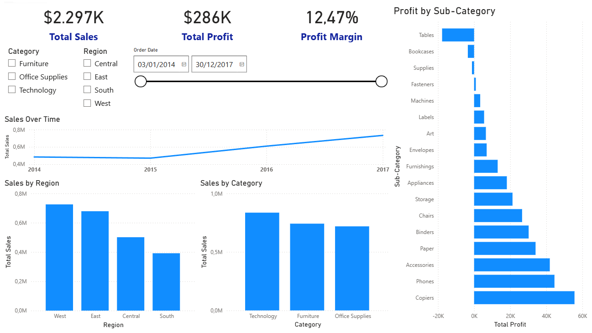

# Retail Sales Analysis

End-to-end data analysis project using Python, SQL, and Power BI, covering data exploration, business analysis, and interactive dashboarding.

---

## Project Overview

This project analyzes retail sales data to identify key drivers of revenue and profitability.  
The workflow combines Python (EDA) and SQL (business queries) to simulate a real-world analytics environment.

The goal is to demonstrate:
- Strong analytical thinking
- Ability to work with real datasets
- Proficiency in Python and SQL
- Clear communication of insights

---

## Tech Stack

- Python: pandas, matplotlib, seaborn  
- SQL: SQLite  
- Power BI (dashboard and data visualization)  
- Jupyter Notebooks  
- Git & GitHub

---

## Project Structure

```
retail-sales-analysis/
│
├── data/
│   └── superstore.csv
│
├── images/
│   └── powerbi_dashboard.png
│
├── notebooks/
│   ├── 01_eda.ipynb
│   ├── 02_business_analysis.ipynb
│   ├── 03_customer_analysis.ipynb
│   ├── 04_product_analysis.ipynb
│   └── 05_final_insights.ipynb
│
├── powerbi/
│   └── retail_sales_dashboard.pbix
│
├── sql/
│   ├── load_to_sqlite.py
│   ├── run_sql.py
│   └── superstore_analysis.sql
│
├── .gitignore
├── README.md
└── requirements.txt
```

---

## Workflow

### 1. Data Exploration (Python)
- Data cleaning and preprocessing
- Understanding distributions and relationships
- Identifying patterns and potential issues

### 2. Business Analysis (Python)
- Revenue and profit trends
- Performance by category and region

### 3. Customer Analysis
- Customer segmentation
- Identification of high-value customers

### 4. Product Analysis
- Best and worst performing products
- Profitability vs sales trade-offs

### 5. SQL Analysis
- Reproducing key business queries in SQL
- Translating analytical thinking into SQL logic

---

## SQL Analysis

In addition to Python-based analysis, key business questions were explored using SQL.

The SQL workflow includes:

- Loading the dataset into a SQLite database
- Writing analytical queries to answer business questions
- Translating Python-based insights into SQL logic

Example queries include:

- Top categories by revenue and profit
- Most profitable customers
- Sales and profit by region
- Impact of discounts on profitability

To run the SQL analysis:

```bash
python sql/load_to_sqlite.py
python sql/run_sql.py
```

All queries are available in:
```
sql/superstore_analysis.sql
```

---

## 📊 Power BI Dashboard

To complement the Python and SQL analysis, an interactive Power BI dashboard was built to visualize key business metrics and insights.

### Features:
- KPIs: Total Sales, Total Profit, Profit Margin
- Sales over time (trend analysis)
- Sales by category and region
- Profitability by sub-category
- Interactive filters (Category, Region, Order Date)

### Dashboard Preview



---

## Key Insights

- Some high-sales categories generate low or negative profit
- A small subset of customers drives a large portion of revenue
- Discounts have a strong impact on profitability
- Not all top-selling products are profitable

---

## How to Run

### 1. Clone the repository
```bash
git clone https://github.com/juampymv/retail-sales-analysis.git
cd retail-sales-analysis
```

### 2. Install dependencies
```bash
pip install -r requirements.txt
```

### 3. Create the database
```bash
python sql/load_to_sqlite.py
```

### 4. Run SQL queries
```bash
python sql/run_sql.py
```

### 5. Open notebooks
```bash
jupyter notebook
```

---

## What This Project Demonstrates

- Ability to go from raw data to insights
- Strong foundation in EDA and data analysis
- Practical use of SQL for business problems
- Clear and structured analytical workflow

---

## Next Steps

- Deploy the dashboard using Power BI Service
- Build a data application (e.g., Streamlit)
- Apply machine learning models

---

## Author

Juan Pablo Moreno  
Data Scientist
